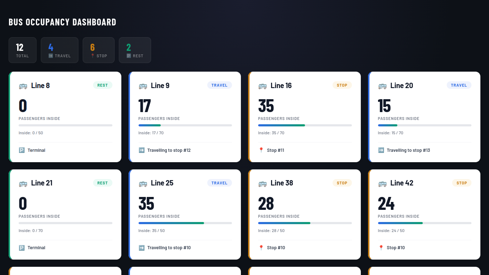

# IoT Bus Monitoring & Simulation System

This project is a simple IoT-based bus monitoring and simulation system designed to demonstrate how real-time vehicle data can be collected, transmitted, and visualized.

The system simulates bus lines that publish data via the MQTT protocol, using Mosquitto as the message broker. A Flask backend application subscribes to these MQTT messages, processes the incoming data, and broadcasts updates to the frontend in real time using WebSockets.

The project focuses on:

- Real-time communication using MQTT
- Backend development with Flask and WebSocket
- Practical demonstration of IoT concepts in a web environment

This system is intended for educational purposes and serves as a foundation for experimenting with IoT architectures and smart transportation systems.

## Tech Stack

**Frontend:** HTML5, CSS3, JavaScript

**Backend:** Python, Flask, SQLAlchemy

**Database:** SQLite

**Messaging & Communication:** MQTT, Mosquitto, WebSocket

**Simulation:** Python

**Tools & Environment:** Git, pip, Virtual Environment (venv)

## Prerequisites

- Python
- Mosquitto MQTT Broker

Make sure both Python and Mosquitto are properly installed and available in your system PATH.

## Run Locally

**_Windows_**

Clone the repository:

    git clone https://github.com/VukasinAleksic32/iot-bus-monitoring-simulation-system.git

Go to the project directory:

    cd iot-bus-monitoring-simulation-system

Run the project:

    runme.bat

**_Linux_**

Clone the repository:

    git clone https://github.com/VukasinAleksic32/iot-bus-monitoring-simulation-system.git

Go to the project directory:

    cd iot-bus-monitoring-simulation-system

Make the script executable (only once):

    chmod +x runme.sh

Run the project:

    ./runme.sh

## Authors

Vukašin Aleksić
